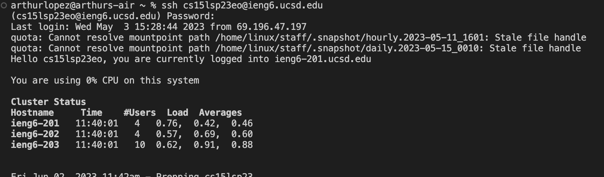
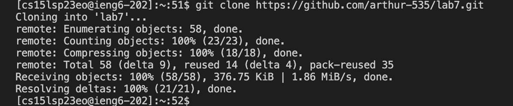
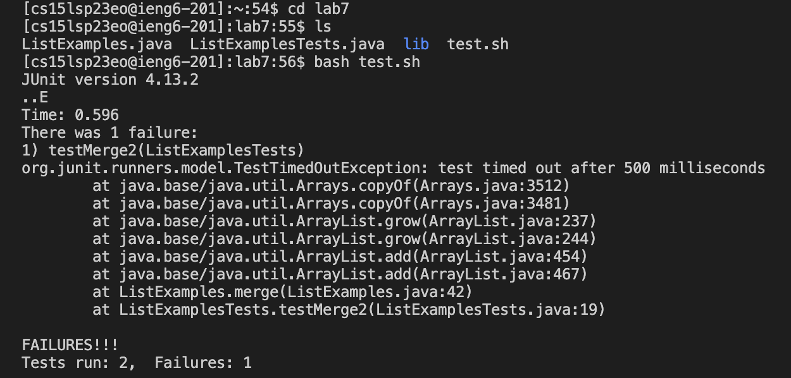
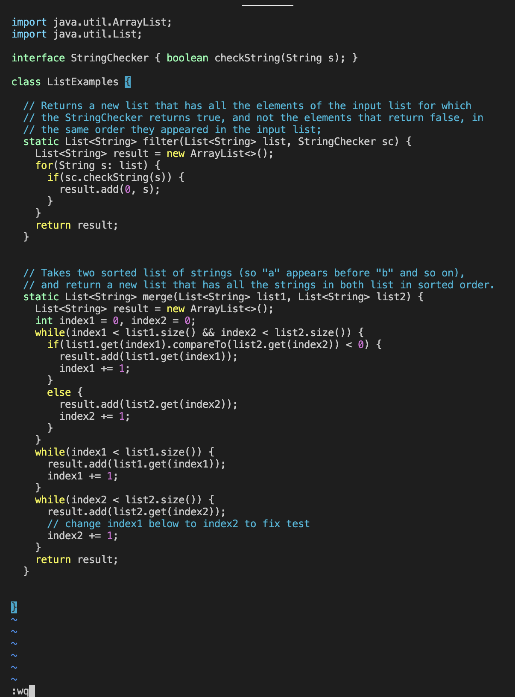

# CSE15L LAB 4 REPORT 

For the lab report this week, I am going to reproduce the task from above on my own. For each numbered step(so steps 4-9), I will take a screenshot,
and write down exactly which keys I pressed to get to that step


**Log into ieng6**

For this step, you just need to type in "ssh" + your cs15L usernmane. 
Then you'll be asked to enter your password to fully login to ieng6.

Command
``` 
ssh cs15lsp23eo@ieng6.ucsd.edu

 ``` 

Output




**Clone your fork of the repository from your Github account**

For this step, you'll want to access your github account on your internet browswer. 
Find the lab 7 repository and fork it. Then once you have a copy of the repository. Now copy the url of YOUR lab 7 repository.  
Then go the VS Code and enter this command

Example 1 

Command
``` 
git clone <url>

 ```
 Output
 

 

**Run the tests, demonstrating that they fail**

For this step, since the code already fails, all we need to do is run the test. 
Todo that, we must enter this command. 

Command
``` 
bash test.sh

 ``` 

Output




**Fix the Error**

For this step, we are already told where the error is and how to fix it. Rather than going to trying to open the file on a text editor. 
We are going to use the command "vim" along with the file that we want to open.  
Then we are goin to going to click <i> to start editing the file. Once you are done editing click "esc" then ":wp"

Command
``` 
vim ListExamples.java
 
:wp

 ``` 
Output




